# Duevora Application Docker Configuration

This project is configured with a fully containerized Docker workflow for both **Development** and **Production** environments, using an external MongoDB instance (e.g. MongoDB Atlas) via the `MONGO_URI` environment variable.

---

## 🛠️ Development Environment

The development environment runs the client (Vite + React) and the server (Node + Express) in separate, hot-reloading containers.

### Features
* **Zero-Rebuild Code Updates**: The project directories are bind-mounted into the containers. Any edits you make on your local system will immediately update in the container.
* **Automatic `node_modules` Sync**: If you modify `package.json` (e.g. add/update/remove a dependency), a lightweight watcher script inside the container (`watch-package.js`) will detect the change, temporarily stop the app, run `npm install` inside the container, and restart the app. **You do not need to rebuild the containers when dependencies change!**
* **Vite HMR on Windows**: Vite is configured with polling enabled, ensuring HMR works perfectly even when coding on a Windows host.

### How to Run (Development)

1. Make sure you have **Docker** and **Docker Compose** installed.
2. Add your Atlas connection string to the `.env` file inside the `server` directory (`server/.env`):
   ```env
   MONGO_URI=mongodb+srv://<username>:<password>@cluster.mongodb.net/duevora
   ```
3. Start the development environment:
   ```bash
   docker compose up
   ```
4. Open your browser:
   * **Frontend (Vite Dev Server)**: [http://localhost:5173](http://localhost:5173)
   * **Backend API Server**: [http://localhost:3000](http://localhost:3000)

### Stopping the Dev Server
Press `Ctrl + C` or run:
```bash
docker compose down
```

---

## 🚀 Production Environment

In production, the app is packaged into a **single, highly-optimized container** where the Express backend serves the pre-built React frontend assets from the backend's `public/` directory.

### Features
* **Multi-stage Build**: A build stage compiles the frontend into static assets (`dist` directory). A final production stage copies these assets to the server's `public/` directory and exposes the Express app.
* **Minimal Footprint**: Uses `node:20-alpine` and only installs production dependencies (`--only=production`) in the final image.
* **Production Static Serving**: The backend automatically serves the static assets and routes client-side routing fallback endpoints to React's `index.html`.

### How to Run (Production)

1. Start the production container (make sure your database connection is defined in `server/.env`):
   ```bash
   docker compose -f docker-compose.prod.yml up --build
   ```

2. Open the application:
   * Both frontend and backend are unified on port 3000: [http://localhost:3000](http://localhost:3000)

To build and run the standalone production image directly without compose:
```bash
# Build the image
docker build -t duevora-prod .

# Run the image, passing the Atlas connection string
docker run -p 3000:3000 -e MONGO_URI="mongodb+srv://<username>:<password>@cluster.mongodb.net/duevora" duevora-prod
```

---

## 📁 Architecture and Ports Summary

* **Frontend Container (Dev)**:
  * Port: `5173` (mapped from inside Vite `0.0.0.0:5173`)
  * Command: Runs `watch-package.js npm run dev -- --host`
  * Proxy: forwards `/api` to `http://127.0.0.1:3000` during local development.
    Docker Compose overrides it with `VITE_API_PROXY_TARGET=http://server:3000`.

* **Backend Container (Dev & Prod)**:
  * Port: `3000` (mapped from Express server)
  * Dev Command: Runs `watch-package.js npm run dev` (starts Nodemon)
  * Prod Command: Runs `node server.js`
  * Database: Connects to external MongoDB (MongoDB Atlas) specified by `MONGO_URI`

---

## 📡 API Reference

All endpoints are prefixed with `/api`. Authentication uses **JWT Bearer tokens**. The `organizationId` is resolved automatically from the token — never pass it in the body or headers.

### Global Response Format

```json
// Success
{ "success": true, "message": "...", "data": {} }

// Error
{ "success": false, "message": "...", "errors": [{ "field": "email", "issue": "Invalid" }] }
```

---

### 🔐 Module 1 — Identity & Access Management

| Endpoint | Method | Auth | Input | Output | Use |
|---|---|---|---|---|---|
| `/api/auth/signup` | POST | Public | `name`, `email`, `password`, `organizationName`, `organizationCode` | `user`, `organization` | Register a new user |
| `/api/auth/login` | POST | Public | `email`, `password` | `accessToken`, `refreshToken`, `userId` | Authenticate & get tokens |
| `/api/auth/refresh` | POST | Public | `refreshToken` | New `accessToken` | Renew expired token |
| `/api/organization` | POST | Bearer | `name`, `code`, `firstName`, `lastName`, `address?` | `user`, `org`, `employee`, `accessToken` | Onboard new organisation |
| `/api/organization` | GET | Bearer + `organization.view` | — | Organisation document | Fetch org details |
| `/api/users` | GET | Bearer + `users.view` | `page`, `limit`, `search` | Users array + pagination | List all users |
| `/api/users/:userId` | PUT | Bearer + `users.update` | Any user fields | Updated user | Update user profile |
| `/api/users/:userId` | DELETE | Bearer + `users.delete` | — | Confirmation | Soft-delete user |
| `/api/employees` | POST | Bearer + `employees.create` | `employeeCode`, `firstName`, `lastName`, `email`, `departmentId?` | Created employee | Create employee record |
| `/api/employees/invite` | POST | Bearer + `employees.create` | `email`, `roleId` | Invite token + link | Send email invitation |
| `/api/employees/bulk-import` | POST | Bearer + `employees.create` | `employees[]` array | Created employees | Import employees in bulk |
| `/api/departments` | POST | Bearer + `departments.create` | `name`, `code` | Created department | Create a department |
| `/api/roles` | POST | Bearer + `roles.create` | `name`, `code` | Created role | Create RBAC role |
| `/api/roles/:roleId/permissions` | POST | Bearer | `permissionIds[]` | Role-permission mapping | Bind permissions to role |

---

### 🗂️ Module 2 — Master Data Management

| Endpoint | Method | Auth | Input | Output | Use |
|---|---|---|---|---|---|
| `/api/customers` | POST | Bearer + `customers.create` | `name`, `email?`, `phone?`, `gstin?` | Created customer | Add a customer |
| `/api/customers` | GET | Bearer + `customers.view` | `page`, `limit`, `search` | Customers + pagination | List all customers |
| `/api/customers/:id` | GET | Bearer + `customers.view` | — | Customer object | Get single customer |
| `/api/customers/:id` | PUT | Bearer + `customers.update` | Any customer fields | Updated customer | Update customer |
| `/api/customers/:id` | DELETE | Bearer + `customers.delete` | — | Confirmation | Soft-delete customer |
| `/api/customers/bulk-import` | POST | Bearer + `customers.create` | `customers[]` | Created customers | Bulk import |
| `/api/customers/bulk-delete` | DELETE | Bearer + `customers.delete` | `customerIds[]` | Delete count | Bulk soft-delete |
| `/api/vendors` | POST/GET/PUT/DELETE | Bearer | Same as customers | Same as customers | Full CRUD for vendors |
| `/api/vendors/bulk-import` | POST | Bearer | `vendors[]` | Created vendors | Bulk import vendors |
| `/api/vendors/bulk-update` | PATCH | Bearer | `vendors[]` | Updated vendors | Bulk update vendors |
| `/api/categories` | POST | Bearer + `categories.create` | `name`, `parentId?` | Created category | Create product category |
| `/api/units` | POST | Bearer + `units.create` | `name`, `code` | Created unit | Create unit of measure |
| `/api/products` | POST | Bearer + `products.create` | `name`, `sku`, `categoryId`, `unitId`, `sellingPrice`, `costPrice`, `taxId?` | Created product | Add product to catalog |
| `/api/products` | GET | Bearer + `products.view` | `page`, `limit`, `search` | Products + pagination | List products |
| `/api/products/:id` | GET/PUT/DELETE | Bearer | — / product fields / — | Product / Updated / Confirmation | Single product CRUD |
| `/api/products/bulk-import` | POST | Bearer | `products[]` | Created products | Bulk import products |
| `/api/warehouses` | POST | Bearer + `warehouses.create` | `name`, `code`, `address?` | Created warehouse | Register storage location |
| `/api/currencies` | POST | Bearer + `currencies.create` | `name`, `code`, `symbol` | Created currency | Add currency |
| `/api/exchange-rates` | POST | Bearer + `exchangeRates.create` | `currencyId`, `rate`, `effectiveDate` | Created rate record | Record exchange rate |
| `/api/taxes` | POST | Bearer + `taxes.create` | `name`, `rate`, `type` | Created tax | Define tax rate |

---

### 📦 Module 3 — Inventory & Stock Management

| Endpoint | Method | Auth | Input | Output | Use |
|---|---|---|---|---|---|
| `/api/inventory` | GET | Bearer + `inventory.view` | `warehouseId?`, `productId?` | `[{ product, warehouse, quantity }]` | View current stock levels |
| `/api/stock-movements` | GET | Bearer + `stockMovements.view` | `productId?`, `warehouseId?` | Movement records | Full stock audit trail |
| `/api/stock-adjustments` | POST | Bearer + `stockAdjustments.create` | `warehouseId`, `productId`, `quantityChange`, `reason` | Adjustment (`Draft`) | Manual stock correction |
| `/api/stock-adjustments/:id/approve` | POST | Bearer + `stockAdjustments.approve` | — | Adjustment (`Completed`) + inventory update | Apply the adjustment |
| `/api/stock-transfers` | POST | Bearer + `stockTransfers.create` | `sourceWarehouseId`, `destinationWarehouseId`, `productId`, `quantity` | Transfer (`Pending Transit`) | Initiate stock move |
| `/api/stock-transfers/:id/approve` | POST | Bearer + `stockTransfers.approve` | — | Transfer (`Received`) + inventory update | Complete the transfer |

---

### 🛒 Module 4 — Sales & Procurement Documents

| Endpoint | Method | Auth | Input | Output | Use |
|---|---|---|---|---|---|
| `/api/quotations` | POST | Bearer + `quotations.create` | `customerId`, `items[]`, `validUntil?` | Quotation (`Draft`) | Create price quote |
| `/api/quotations/:id/approve` | POST | Bearer + `quotations.approve` | — | Quotation (`Accepted`) | Accept the quote |
| `/api/sales-orders` | POST | Bearer + `salesOrders.create` | `customerId`, `items[]`, `quotationId?` | Sales Order (`Draft`) | Create sales order |
| `/api/sales-orders/:id/approve` | POST | Bearer + `salesOrders.approve` | — | Order (`Processing`) | Confirm order |
| `/api/delivery-challans` | POST | Bearer + `deliveryChallans.create` | `salesOrderId`, `items[]`, `dispatchDate` | Delivery challan | Dispatch goods |
| `/api/invoices` | POST | Bearer + `invoices.create` | `customerId`, `items[]`, `dueDate` | Invoice (`Draft`) | Create customer invoice |
| `/api/invoices/:id/approve` | POST | Bearer + `invoices.approve` | — | Invoice + journal entries + stock decrement | Post the invoice |
| `/api/purchase-orders` | POST | Bearer + `purchaseOrders.create` | `vendorId`, `items[]`, `expectedDate?` | PO (`Draft`) | Raise vendor PO |
| `/api/purchases` | POST | Bearer + `purchases.create` | `vendorId`, `purchaseOrderId?`, `items[]`, `billDate` | Purchase (`Draft`) | Record vendor bill |
| `/api/purchases/:id/approve` | POST | Bearer + `purchases.approve` | — | Purchase + stock increment + journal entries | Confirm receipt |

---

### 🏦 Module 5 — Treasury & Cash Management

| Endpoint | Method | Auth | Input | Output | Accounting Entry |
|---|---|---|---|---|---|
| `/api/payments` | POST | Bearer + `payments.create` | `vendorId`, `bankAccountId`, `amount`, `paymentDate`, `method` | Payment + ledger entry | Debit AP / Credit Bank |
| `/api/receipts` | POST | Bearer + `receipts.create` | `customerId`, `bankAccountId`, `amount`, `receiptDate`, `method` | Receipt + ledger entry | Debit Bank / Credit AR |
| `/api/expenses` | POST | Bearer + `expenses.create` | `expenseAccountId`, `bankAccountId`, `amount`, `date`, `description` | Expense + ledger entry | Debit Expense / Credit Bank |
| `/api/incomes` | POST | Bearer + `incomes.create` | `incomeAccountId`, `bankAccountId`, `amount`, `date`, `description` | Income + ledger entry | Debit Bank / Credit Income |
| `/api/bank-accounts` | POST | Bearer + `bankAccounts.create` | `name`, `accountNumber`, `bankName`, `ifscCode?`, `openingBalance?` | Created bank account | — |
| `/api/bank-transactions` | POST | Bearer + `bankTransactions.create` | `bankAccountId`, `amount`, `type`, `date`, `description` | Created transaction | — |
| `/api/reminders` | POST | Bearer + `reminders.create` | `title`, `dueDate`, `description?` | Created reminder | — |

---

### 📒 Module 6 — General Ledger & Accounting

| Endpoint | Method | Auth | Input | Output | Use |
|---|---|---|---|---|---|
| `/api/accounts` | POST | Bearer + `accounts.create` | `name`, `code`, `type` (`Asset`/`Liability`/`Equity`/`Revenue`/`Expense`), `parentId?` | Created account | Build chart of accounts |
| `/api/journal-entries` | POST | Bearer + `journalEntries.create` | `date`, `description`, `lines[]` (`accountId`, `debit`, `credit`) | Journal entry (`Posted`) | Manual double-entry bookkeeping |
| `/api/ledger` | GET | Bearer + `ledger.view` | `accountId`, `startDate?`, `endDate?`, `page`, `limit` | Ledger entries + running balance | View account statement |
| `/api/voucher-types` | POST | Bearer + `voucherTypes.create` | `name`, `prefix`, `type` | Created voucher type | Define custom voucher prefix |
| `/api/financial-years` | POST | Bearer + `financialYears.create` | `name`, `startDate`, `endDate` | Financial year (`isClosed: false`) | Open a new FY period |
| `/api/financial-years/:id/archive` | POST | Bearer + `financialYears.archive` | — | Financial year (`isClosed: true`) | Lock the FY permanently |
| `/api/opening-balances` | POST | Bearer + `openingBalances.create` | `accountId`, `financialYearId`, `debit`, `credit` | Created opening balance | Set account starting balance |
| `/api/cost-centers` | POST | Bearer + `costCenters.create` | `name`, `code` | Created cost center | Tag expenses to cost centers |
| `/api/projects` | POST | Bearer + `projects.create` | `name`, `code`, `startDate?`, `endDate?` | Created project | Track project-level P&L |
| `/api/budgets` | POST | Bearer + `budgets.create` | `accountId`, `financialYearId`, `amount` | Created budget | Set account budget cap |

---

### 🔔 Module 7 — Utility & Metadata

| Endpoint | Method | Auth | Input | Output | Use |
|---|---|---|---|---|---|
| `/api/notifications` | GET | Bearer | `page`, `limit`, `isRead?` | Notification array | In-app notification feed |
| `/api/audit-logs` | GET | Bearer + `auditLogs.view` | `resourceType?`, `resourceId?`, `page`, `limit` | Audit log entries | Full mutation history |
| `/api/settings` | PUT | Bearer + `settings.update` | `key`, `value` | Saved setting | Upsert org-level config |

---

### 📊 Module 8 — Reports

All reports use **MongoDB Aggregation Pipelines** on `LedgerEntry`. All accept optional `startDate` / `endDate` query params.

| Endpoint | Output | Use |
|---|---|---|
| `GET /api/reports/trial-balance` | `[{ account, totalDebit, totalCredit, balance }]` | Verify books balance |
| `GET /api/reports/profit-loss` | `{ revenue, expenses, netProfit }` | P&L for any date range |
| `GET /api/reports/balance-sheet` | `{ assets, liabilities, equity }` | Financial position snapshot |
| `GET /api/reports/cash-flow` | `{ inflow, outflow, netCashFlow }` | Net cash movement |

---

## 🗺️ System Architecture & API Flow Diagram

```mermaid
flowchart TD
    subgraph IAM["🔐 Identity & Access Management"]
        AUTH["POST /auth/signup\nPOST /auth/login\nPOST /auth/refresh"]
        ORG["POST /organization\nGET /organization"]
        USERS["GET PUT DELETE /users"]
        EMP["POST /employees\nPOST /employees/invite\nPOST /employees/bulk-import"]
        ROLES["POST /roles\nPOST /roles/:id/permissions"]
    end

    subgraph MASTER["🗂️ Master Data"]
        CUST["CRUD /customers"]
        VEND["CRUD /vendors"]
        PROD["CRUD /products"]
        WH["POST /warehouses"]
        TAX["POST /taxes"]
        CUR["POST /currencies\nPOST /exchange-rates"]
    end

    subgraph STOCK["📦 Inventory"]
        INV["GET /inventory"]
        SM["GET /stock-movements"]
        SA["POST /stock-adjustments\nPOST .../approve"]
        ST["POST /stock-transfers\nPOST .../approve"]
    end

    subgraph SALES["🛒 Sales Pipeline"]
        QUOT["POST /quotations → approve"]
        SO["POST /sales-orders → approve"]
        DC["POST /delivery-challans"]
        INV2["POST /invoices → approve"]
        REC["POST /receipts"]
    end

    subgraph PROC["📋 Procurement Pipeline"]
        PO["POST /purchase-orders"]
        PUR["POST /purchases → approve"]
        PAY["POST /payments"]
    end

    subgraph TREASURY["🏦 Treasury"]
        EXP["POST /expenses"]
        INC["POST /incomes"]
        BA["POST /bank-accounts"]
        BT["POST /bank-transactions"]
    end

    subgraph GL["📒 General Ledger"]
        ACC["POST /accounts"]
        JE["POST /journal-entries"]
        LED["GET /ledger"]
        FY["POST /financial-years\nPOST .../archive"]
        OB["POST /opening-balances"]
    end

    subgraph RPT["📊 Reports"]
        TB["GET /reports/trial-balance"]
        PL["GET /reports/profit-loss"]
        BS["GET /reports/balance-sheet"]
        CF["GET /reports/cash-flow"]
    end

    subgraph UTIL["🔔 Utility"]
        NOTIF["GET /notifications"]
        AUDIT["GET /audit-logs"]
        SET["PUT /settings"]
    end

    %% Auth gates everything
    AUTH -->|"JWT issued"| ORG & USERS & EMP & ROLES

    %% Master data feeds documents
    CUST -->|"customer ref"| QUOT & INV2 & REC
    VEND -->|"vendor ref"| PO & PUR & PAY
    PROD -->|"line items"| QUOT & INV2 & PUR
    WH -->|"location"| INV & SA & ST
    TAX -->|"applied to"| QUOT & INV2 & PUR

    %% Sales flow
    QUOT -->|"accepted"| SO
    SO -->|"confirmed"| DC
    DC -->|"updates stock"| INV
    SO -->|"billed"| INV2
    INV2 -->|"approve → posts"| JE
    REC -->|"clears AR"| JE

    %% Procurement flow
    PO -->|"approved"| PUR
    PUR -->|"approve → increments"| INV
    PUR -->|"posts AP"| JE
    PAY -->|"settles AP"| JE

    %% Treasury → Ledger
    EXP & INC & BT -->|"ledger entries"| JE
    BA -->|"bank account"| PAY & REC & EXP & INC

    %% Stock logs
    SA & ST -->|"approve → logs"| SM
    SA & ST -->|"approve → updates"| INV

    %% Ledger chain
    JE -->|"posts to"| LED
    ACC -->|"account tree"| JE & LED
    FY -->|"period scope"| OB
    FY -->|"archive locks"| LED

    %% Reports read ledger
    LED -->|"aggregated"| TB & PL & BS & CF

    %% Utility observes
    AUDIT -.->|"monitors"| SALES & PROC & GL & STOCK
    NOTIF -.->|"alerts"| SALES & PROC
    SET -.->|"configures"| ORG
```



---

## 🧪 Running Tests

```bash
# Full suite (622 tests across 105 suites)
npm test

# DAO unit tests only
npm run test:dao

# Per-feature (examples)
npm run test:auth
npm run test:customers
npm run test:invoices
npm run test:financial-years
npm run test:reports
# Full list of commands is in server/package.json
```

> **Tip:** `BCRYPT_ROUNDS=1` in `server/.env` makes tests ~60–70% faster. Use `10+` in production.

---

## Payment Reminder and Razorpay Test Flow

This flow creates or reuses a Razorpay Payment Link for an approved customer invoice, schedules durable email/WhatsApp reminders through MongoDB and BullMQ, and records successful customer payments as incoming Receipts. Razorpay's signed webhook is the canonical payment source; the browser callback is only a user-experience redirect and never marks an invoice as paid.

### Environment configuration

Copy the safe example, replace every placeholder locally, and never commit credentials:

```bash
cp server/.env.example server/.env
```

The feature-related variables are grouped below. Razorpay credentials are required when `RAZORPAY_ENABLED=true`; SMTP credentials are required when `SEND_MAIL=true`; WhatsApp Cloud credentials are required only when `WHATSAPP_MODE=cloud`.

```env
# Core API, MongoDB and authentication
PORT=3000
NODE_ENV=development
MONGO_URI=mongodb://localhost:27017/duevora
ACCESS_TOKEN_SECRET=<LONG_RANDOM_ACCESS_TOKEN_SECRET>
REFRESH_TOKEN_SECRET=<LONG_RANDOM_REFRESH_TOKEN_SECRET>
FRONTEND_URL=http://localhost:5173
APP_BASE_URL=http://localhost:5173

# SMTP email
SEND_MAIL=true
SMTP_HOST=<SMTP_HOST>
SMTP_PORT=587
SMTP_USER=<SMTP_USERNAME>
SMTP_PASS=<SMTP_PASSWORD_OR_APP_PASSWORD>
SENDING_USER=Duevora <noreply@example.com>

# Razorpay Test Mode
RAZORPAY_ENABLED=true
RAZORPAY_KEY_ID=<RAZORPAY_TEST_KEY_ID>
RAZORPAY_KEY_SECRET=<RAZORPAY_TEST_KEY_SECRET>
RAZORPAY_WEBHOOK_SECRET=<SEPARATE_RANDOM_WEBHOOK_SECRET>
RAZORPAY_API_BASE_URL=https://api.razorpay.com/v1

# Redis, BullMQ and reminder recovery
REDIS_URL=redis://localhost:6379
BULLMQ_PREFIX=duevora
REMINDER_QUEUE_NAME=payment-reminders
REMINDER_QUEUE_ENABLED=true
REMINDER_WORKER_IN_PROCESS=true
REMINDER_WORKER_CONCURRENCY=5
REMINDER_WORKER_STARTUP_ATTEMPTS=5
REMINDER_WORKER_STARTUP_BACKOFF_MS=1000
REMINDER_JOB_ATTEMPTS=3
REMINDER_JOB_BACKOFF_MS=60000
REMINDER_RECOVERY_INTERVAL_MS=60000
REMINDER_RECOVERY_BATCH_SIZE=25

# WhatsApp: disabled, deeplink or cloud
WHATSAPP_MODE=deeplink
WHATSAPP_DEFAULT_COUNTRY_CODE=91
WHATSAPP_API_VERSION=<META_GRAPH_API_VERSION>
WHATSAPP_PHONE_NUMBER_ID=<META_PHONE_NUMBER_ID>
WHATSAPP_ACCESS_TOKEN=<META_ACCESS_TOKEN>
WHATSAPP_TEMPLATE_NAME=<APPROVED_TEMPLATE_NAME>
WHATSAPP_TEMPLATE_LANGUAGE=en
```

For SMTP port `465`, the transport uses implicit TLS. Port `587` uses the provider's STARTTLS flow. Use a provider app password where required; set `SEND_MAIL=false` when email delivery is intentionally disabled.

### Start MongoDB, Redis, the API and Worker

Use MongoDB Atlas by setting its connection string as `MONGO_URI`, or start a local MongoDB container once:

```bash
docker run --detach --name duevora-mongo \
  --publish 27017:27017 \
  --volume duevora-mongo-data:/data/db \
  mongo:7

# On later runs, start the existing container with:
docker start duevora-mongo
```

Start the repository's Redis service, then start the API:

```bash
docker compose up --detach redis

cd server
npm install
npm run dev
```

For a hosted Upstash database, use the native TLS Redis connection string from
the Upstash Console's **Connect → Node.js/ioredis** section. BullMQ requires the
native Redis protocol rather than the REST URL:

```env
REDIS_URL=rediss://default:<UPSTASH_PASSWORD>@<UPSTASH_ENDPOINT>.upstash.io:6379
```

Duevora enables TLS automatically for `rediss://` endpoints and gives a hosted
Worker a bounded exponential startup-retry window before degrading the API.
Keep `REMINDER_WORKER_STARTUP_ATTEMPTS` and
`REMINDER_WORKER_STARTUP_BACKOFF_MS` positive. Upstash free-tier command limits
still apply, and BullMQ performs regular Redis operations even while idle.

For a separate production-style Worker, set `REMINDER_WORKER_IN_PROCESS=false` in `server/.env`, leave the API running, and use another terminal:

```bash
cd server
npm run dev:worker   # nodemon during development
# or
npm run worker       # node worker.js
```

For a single-process hackathon demo, set both `REMINDER_QUEUE_ENABLED=true` and `REMINDER_WORKER_IN_PROCESS=true`, then run only `npm run dev`; the API starts the Worker and recovery loop after MongoDB is ready. A separately running Worker must use the same MongoDB, Redis, queue name and BullMQ prefix as the API.

### WhatsApp modes and Cloud template

- `WHATSAPP_MODE=disabled`: WhatsApp is skipped and no Meta request or deeplink is created.
- `WHATSAPP_MODE=deeplink`: the API returns a URL-encoded `whatsappDeepLink`. The seller must open it and press Send; this mode does not claim automatic delivery.
- `WHATSAPP_MODE=cloud`: the Worker sends an approved Meta WhatsApp template automatically. Configure the Graph API version, phone-number ID, access token, template name and language.

The approved Cloud template must use body variables in this exact order:

1. Customer name
2. Organization name
3. Invoice number
4. Outstanding amount
5. Due date
6. Payment URL

Recommended template text:

> Hello {{1}}, this is a payment reminder from {{2}} for invoice {{3}}. The outstanding amount is {{4}} and the due date is {{5}}. Pay securely using {{6}}.

### Razorpay Test Mode and webhook setup

1. Sign in to the Razorpay Dashboard and switch to **Test Mode**.
2. Open **Account & Settings → API Keys**, generate a Test key, and set its key ID and key secret as `RAZORPAY_KEY_ID` and `RAZORPAY_KEY_SECRET`.
3. Open **Webhooks**, add `{BACKEND_URL}/api/webhooks/razorpay`, and choose a new random webhook secret. Put that same value in `RAZORPAY_WEBHOOK_SECRET`. The webhook secret is deliberately different from `RAZORPAY_KEY_SECRET`.
4. Subscribe to `payment_link.paid`, `payment_link.partially_paid`, `payment_link.cancelled`, and `payment_link.expired`.
5. Save the webhook and complete payments with Razorpay's Test Mode payment methods. Test Mode does not collect or transfer real money.

A deployed webhook URL must use public HTTPS. For local testing, expose port `3000` through a trusted HTTPS tunnel and use the tunnel's `/api/webhooks/razorpay` URL. Do not simulate success in the browser or call the webhook with an unsigned payload: only a correctly signed Razorpay webhook creates the Receipt, posts its journal/ledger entries, updates the invoice, and completes pending reminders.

After webhook processing succeeds, the seller dashboard frontend should refetch `GET /api/dashboard/summary`; it must not treat the browser callback or stale client state as payment truth.

### Exact demo sequence

1. Create a customer with an email address and, for WhatsApp, a valid phone number.
2. Create an invoice for that customer.
3. Approve/send the invoice so its status is payable.
4. Create a reminder; the backend creates or reuses its Razorpay Payment Link and queues the reminder.
5. Send it immediately with `wait=true` for the demo, or leave it scheduled for the Worker.
6. Open the returned Razorpay payment URL.
7. Complete a Razorpay Test Mode payment.
8. Let Razorpay send the signed webhook to the configured HTTPS endpoint.
9. Fetch the invoice and verify that its status is `partially_paid` or `paid` and that an incoming Receipt exists.
10. Fetch the dashboard summary and verify the updated collection/outstanding totals and recent payment.

### Exact curl examples

Set these shell placeholders first. Read `paymentLinkId` from the Payment Link response and `reminder.reminderId` from the Create Reminder response.

```bash
API_BASE_URL="http://localhost:3000/api"
BEARER_TOKEN="<JWT_ACCESS_TOKEN>"
INVOICE_ID="<INVOICE_OBJECT_ID>"
PAYMENT_LINK_ID="<LOCAL_PAYMENT_LINK_OBJECT_ID>"
REMINDER_ID="<REMINDER_OBJECT_ID>"
SCHEDULED_FOR="<FUTURE_ISO_8601_UTC_DATE>"
```

1. Create or reuse a Payment Link:

```bash
curl --fail-with-body --silent --show-error \
  --request POST \
  --url "${API_BASE_URL}/invoices/${INVOICE_ID}/payment-link" \
  --header "Authorization: Bearer ${BEARER_TOKEN}"
```

2. Get the current Payment Link:

```bash
curl --fail-with-body --silent --show-error \
  --request GET \
  --url "${API_BASE_URL}/invoices/${INVOICE_ID}/payment-link" \
  --header "Authorization: Bearer ${BEARER_TOKEN}"
```

3. Create a Reminder:

```bash
curl --fail-with-body --silent --show-error \
  --request POST \
  --url "${API_BASE_URL}/reminders" \
  --header "Authorization: Bearer ${BEARER_TOKEN}" \
  --header "Content-Type: application/json" \
  --data "{\"invoiceId\":\"${INVOICE_ID}\",\"scheduledFor\":\"${SCHEDULED_FOR}\",\"channels\":[\"email\",\"whatsapp\"],\"title\":\"Invoice payment reminder\",\"description\":\"Please pay the outstanding invoice balance.\"}"
```

4. Queue a Reminder for immediate delivery:

```bash
curl --fail-with-body --silent --show-error \
  --request POST \
  --url "${API_BASE_URL}/reminders/${REMINDER_ID}/send" \
  --header "Authorization: Bearer ${BEARER_TOKEN}"
```

5. Send a Reminder synchronously with `wait=true`:

```bash
curl --fail-with-body --silent --show-error \
  --request POST \
  --url "${API_BASE_URL}/reminders/${REMINDER_ID}/send?wait=true" \
  --header "Authorization: Bearer ${BEARER_TOKEN}"
```

Commands 4 and 5 are alternatives for one active reminder; do not run both sequentially against a reminder that has already completed delivery.

6. List Reminders:

```bash
curl --fail-with-body --silent --show-error \
  --request GET \
  --url "${API_BASE_URL}/reminders?page=1&limit=20&sortBy=scheduledFor&sortOrder=asc" \
  --header "Authorization: Bearer ${BEARER_TOKEN}"
```

7. Get one Reminder:

```bash
curl --fail-with-body --silent --show-error \
  --request GET \
  --url "${API_BASE_URL}/reminders/${REMINDER_ID}" \
  --header "Authorization: Bearer ${BEARER_TOKEN}"
```

8. Cancel a Reminder:

```bash
curl --fail-with-body --silent --show-error \
  --request PATCH \
  --url "${API_BASE_URL}/reminders/${REMINDER_ID}/cancel" \
  --header "Authorization: Bearer ${BEARER_TOKEN}"
```

9. Cancel a Payment Link:

```bash
curl --fail-with-body --silent --show-error \
  --request POST \
  --url "${API_BASE_URL}/payment-links/${PAYMENT_LINK_ID}/cancel" \
  --header "Authorization: Bearer ${BEARER_TOKEN}"
```

10. Get the Dashboard Summary:

```bash
curl --fail-with-body --silent --show-error \
  --request GET \
  --url "${API_BASE_URL}/dashboard/summary" \
  --header "Authorization: Bearer ${BEARER_TOKEN}"
```
